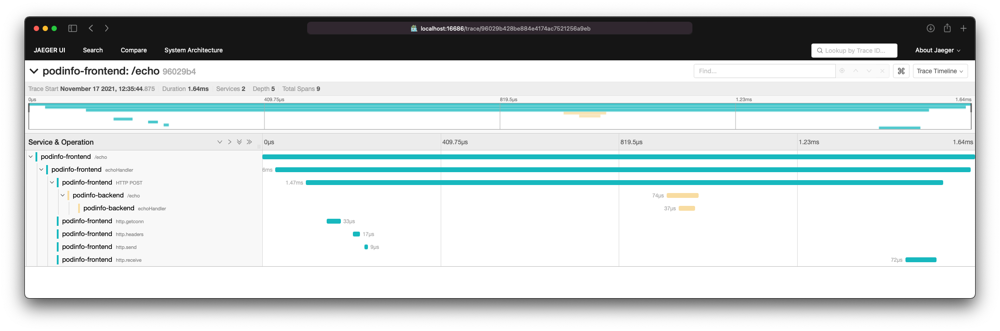
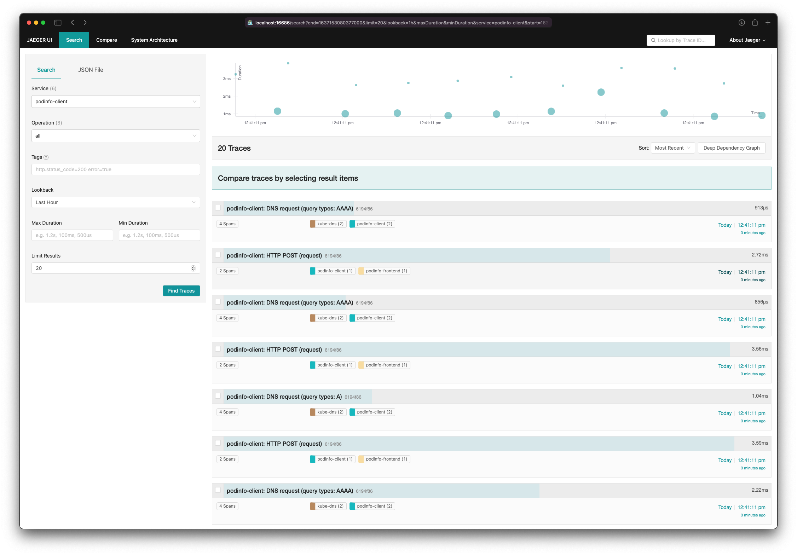
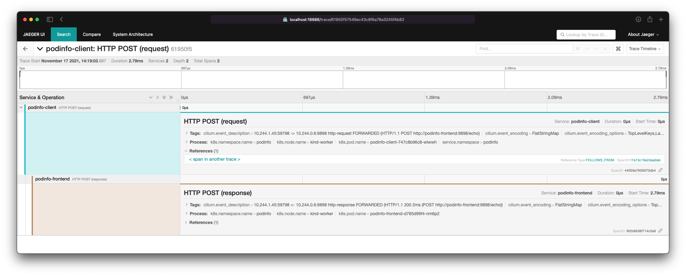
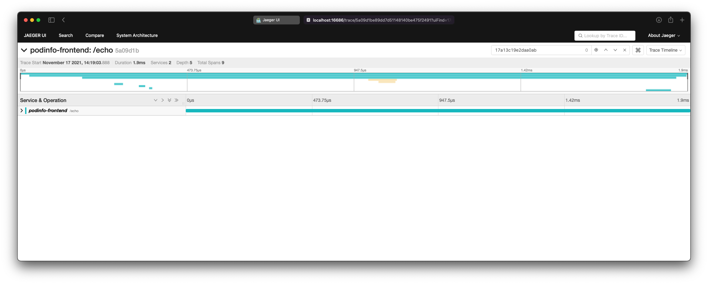

## About

This guide will demonstrate how Hubble adaptor for OpenTelemetry can be used together with Jaeger.

You will learn how to deploy a simple kind cluster with Cilium and Hubble installed, and setup
OpenTelemetry operator with two different `OpenTelemetryCollector` configs, along Jaeger operator
to manager, cert-manager (as dependency of the OpenTelemetry operator).
You will also learn how to deploy a simple demo app with `CiliumNetworkPolicy` and `CiliumClusterwideNetworkPolicy`
to enable DNS and HTTP visibility.

First `OpenTelemetryCollector` config will deploy the Hubble adaptor and configure Hubble receiver
to access L7 flow data from each of the nodes, and write traces to Jaeger, as well as an OTLP receiver
to collect app traces. Second `OpenTelemetryCollector` will deploy upstream OpenTelemetry distribution
to run as sidecars of the demo app.

## Basic setup

Create a 2-node cluster using kind:
```
cat > kind-config.yaml << EOF
kind: Cluster
apiVersion: kind.x-k8s.io/v1alpha4
nodes:
  - role: control-plane
    image: kindest/node:v1.21.1@sha256:fae9a58f17f18f06aeac9772ca8b5ac680ebbed985e266f711d936e91d113bad
    kubeadmConfigPatches:
      - |
        apiVersion: kubeadm.k8s.io/v1beta2
        kind: InitConfiguration
        nodeRegistration:
          taints: []
  - role: worker
    image: kindest/node:v1.21.1@sha256:fae9a58f17f18f06aeac9772ca8b5ac680ebbed985e266f711d936e91d113bad
networking:
  disableDefaultCNI: true
  podSubnet: "10.244.0.0/16"
  serviceSubnet: "10.245.0.0/16"
EOF
kind create cluster --config kind-config.yaml
```

Install Cilim with Hubble enabled:
```
cilium install && cilium hubble enable
```

Install cert-manager as it's a dependency of the OpenTelemetry operator:
```
kubectl apply -k github.com/cilium/kustomize-bases/cert-manager
```

Wait for cert-manager to become ready:
```
(
  set -e
  kubectl wait deployment --namespace="cert-manager" --for="condition=Available" cert-manager-webhook cert-manager-cainjector cert-manager --timeout=3m
  kubectl wait pods --namespace="cert-manager" --for="condition=Ready" --all --timeout=3m
  kubectl wait apiservice --for="condition=Available" v1.cert-manager.io v1.acme.cert-manager.io --timeout=3m
  until kubectl get secret --namespace="cert-manager" cert-manager-webhook-ca 2> /dev/null ; do sleep 0.5 ; done
)
```

Deploy Jaeger operator:
```
kubectl apply -k github.com/cilium/kustomize-bases/jaeger
```

Configure a memory-backed Jaeger instance:
```
cat > jaeger.yaml << EOF
apiVersion: jaegertracing.io/v1
kind: Jaeger
metadata:
  name: jaeger-default
  namespace: jaeger
spec:
  strategy: allInOne
  storage:
    type: memory
    options:
      memory:
        max-traces: 100000
  ingress:
    enabled: false
  annotations:
    scheduler.alpha.kubernetes.io/critical-pod: ""
EOF
kubectl apply -f jaeger.yaml
```

Deploy OpenTelemetry operator:
```
kubectl apply -k github.com/cilium/kustomize-bases/opentelemetry
```

Configure a collector with Hubble receiver and Jaeger exporter:
```
cat > otelcol.yaml << EOF
apiVersion: opentelemetry.io/v1alpha1
kind: OpenTelemetryCollector
metadata:
  name: otelcol-hubble
  namespace: kube-system
spec:
  mode: daemonset
  image: ghcr.io/cilium/hubble-otel/otelcol:v0.1.0
  env:
    - name: NODE_NAME
      valueFrom:
        fieldRef:
          fieldPath: spec.nodeName
  volumes:
    # this example connect to Hubble socket of Cilium agent
    # using host port and TLS
    - name: hubble-tls
      projected:
        defaultMode: 256
        sources:
          - secret:
              name: hubble-relay-client-certs
              items:
                - key: tls.crt
                  path: client.crt
                - key: tls.key
                  path: client.key
                - key: ca.crt
                  path: ca.crt
    # it's possible to use the UNIX socket also, for which
    # the following volume will be needed
    # - name: cilium-run
    #   hostPath:
    #     path: /var/run/cilium
    #     type: Directory
  volumeMounts:
    # - name: cilium-run
    #   mountPath: /var/run/cilium
    - name: hubble-tls
      mountPath: /var/run/hubble-tls
      readOnly: true
  config: |
    receivers:
      otlp:
        protocols:
          grpc:
            endpoint: 0.0.0.0:55690
      hubble:
        endpoint: \${NODE_NAME}:4244 # unix:///var/run/cilium/hubble.sock
        buffer_size: 100
        include_flow_types:
          traces: ["l7"]
        tls:
          insecure_skip_verify: true
          ca_file: /var/run/hubble-tls/ca.crt
          cert_file: /var/run/hubble-tls/client.crt
          key_file: /var/run/hubble-tls/client.key
    processors:
      batch:
        timeout: 30s
        send_batch_size: 100

    exporters:
      logging:
        loglevel: debug
      jaeger:
        endpoint: jaeger-default-collector.jaeger.svc.cluster.local:14250
        tls:
          insecure: true

    service:
      telemetry:
        logs:
          level: info # debug
      pipelines:
        traces:
          receivers: [hubble, otlp]
          processors: [batch]
          exporters: [jaeger]

EOF
kubectl apply -f otelcol.yaml
```

This configuration will deploy the collector as a DaemonSet, you can see the pods by running:
```
kubectl get pod -n kube-system -l app.kubernetes.io/name=otelcol-hubble-collector
```

To view the logs, run:
```
kubectl logs -n kube-system -l app.kubernetes.io/name=otelcol-hubble-collector
```

You should now be able to access Jaeger UI by port-forwarding it:
```
kubectl port-forward svc/jaeger-default-query -n jaeger 16686
```

## Deploying podinfo demo app

The basic setup is done now. However, you probably won't find anything interesting just yet.
Let's get more traces generated, and enable DNS & HTTP visibility in Cilium.

First, create a namespace for the demo app:
```
kubectl create ns podinfo
```

Enable HTTP visibility for the podinfo app and all of DNS traffic:
```
cat > visibility-policies.yaml << EOF
---
apiVersion: cilium.io/v2
kind: CiliumClusterwideNetworkPolicy
metadata:
  name: default-allow
spec:
  endpointSelector: {}
  egress:
    - toEntities:
        - cluster
        - world
    - toEndpoints:
        - {}
---
apiVersion: cilium.io/v2
kind: CiliumClusterwideNetworkPolicy
metadata:
  name: dns-visibility
spec:
  endpointSelector: {}
  egress:
    - toEndpoints:
      - matchLabels:
          k8s:io.kubernetes.pod.namespace: kube-system
          k8s:k8s-app: kube-dns
      toPorts:
      - ports:
        - port: "53"
          protocol: ANY
        rules:
          dns:
            - matchPattern: "*"
    - toFQDNs:
      - matchPattern: "*"
    - toEndpoints:
      - {}
---
apiVersion: cilium.io/v2
kind: CiliumNetworkPolicy
metadata:
  name: http-visibility
  namespace: podinfo
spec:
  endpointSelector: {}
  egress:
    - toPorts:
      - ports:
        - port: "9898"
          protocol: TCP
        rules:
          http:
          - method: ".*"
    - toEndpoints:
      - {}
EOF
kubectl apply -f visibility-policies.yaml
```

The podinfo app is instrumented with OpenTelemetry SDK, one way to export the traces is by using collector sidecar.

Add sidecard config:
```
cat > otelcol-podinfo.yaml << EOF
apiVersion: opentelemetry.io/v1alpha1
kind: OpenTelemetryCollector
metadata:
  name: otelcol-podinfo
  namespace: podinfo
spec:
  mode: sidecar
  config: |
    receivers:
      otlp:
        protocols:
          http: {}
    exporters:
      logging:
        loglevel: info
      otlp:
        endpoint: otelcol-hubble-collector.kube-system.svc.cluster.local:55690
        tls:
          insecure: true

    service:
      telemetry:
        logs:
          level: info
      pipelines:
        traces:
          receivers: [otlp]
          exporters: [otlp, logging]

EOF
kubectl apply -f otelcol-podinfo.yaml
```

Deploy podinfo app itself:
```
kubectl apply -k github.com/cilium/kustomize-bases/podinfo
```

This will result in following deployments and services:
```
$ kubectl get -n podinfo deployments,services 
NAME                               READY   UP-TO-DATE   AVAILABLE   AGE
deployment.apps/podinfo-backend    2/2     2            2           36m
deployment.apps/podinfo-client     2/2     2            2           36m
deployment.apps/podinfo-frontend   2/2     2            2           36m

NAME                       TYPE        CLUSTER-IP      EXTERNAL-IP   PORT(S)             AGE
service/podinfo-backend    ClusterIP   10.245.99.159   <none>        9898/TCP,9999/TCP   36m
service/podinfo-client     ClusterIP   10.245.78.102   <none>        9898/TCP,9999/TCP   36m
service/podinfo-frontend   ClusterIP   10.245.96.163   <none>        9898/TCP,9999/TCP   36m
```

The `podinfo-client` pods will be used to run `curl` commands inside the cluster.

A tracing header can be generated by a client, here is how it can be done with curl:
```
id="$(dd if=/dev/urandom count=24 bs=1 2> /dev/null | xxd -p | head -48)
curl -H "traceparent: 00-${id:0:32}-${id:32:48}-01" [<flags>...] <url>
```

To get some traces in Jaeger, some load does need to be generated, running the above command in a loop should suffice:
```
kubectl -n podinfo exec deployment/podinfo-client -c podinfod -- sh -c 'for i in $(seq 100) ; do \
   id="$(dd if=/dev/urandom count=24 bs=1 2> /dev/null | xxd -p | head -48)"; header="traceparent: 00-${id:0:32}-${id:32:48}-01"; printf "\n${header}\n"; curl -S -H "${header}" -s -d Hubble+OpenTelemetry=ROCKS http://podinfo-frontend:9898/echo
done'
```

You should see output lines like this:
```
traceparent: 00-96029b428be884e4174ac7521256a9eb-5c8d1c8887735cec-01
[
  "Hubble+OpenTelemetry=ROCKS"
]
```

You can grab second segment of the `traceparent` header (i.e. `96029b428be884e4174ac7521256a9eb`), and look it up in Jaeger.

Once you do that, this is what you should see:



To find traces originated from Hubble flow data in Jaeger UI, go to the main page in Jaeger UI, select 'podinfo-client' service and click 'Find Traces'.
You should see results similar to this:



If you click on one of 'HTTP POST (request)' traces, then click to expand each of the spans, and also expand the references, so you will see this:



Clicking on '&lt;span in another trace&gt;' will take to the view of the linked span that originated from the SDK instrumentation in the app itself.

If you expand all of the spans, you will see a full trace similar to this:


